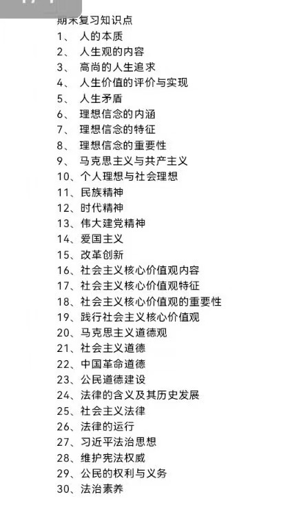

# 思想道德与法治

## 内容

| 文件 | 说明 |
|------|------|
| [期末复习考点清单（30考点）.jpg](./期末复习考点清单（30考点）.jpg) | **老师划的期末复习考点**（原图），覆盖全部 30 个考点 |

## 📌 期末复习考点（老师划的重点，图片原文）

按图片整理的考点速览（复习时逐条对照）：

1. 人的本质
2. 人生观的内容
3. 高尚的人生追求
4. 人生价值的评价与实现
5. 人生矛盾
6. 理想信念的内涵
7. 理想信念的特征
8. 理想信念的重要性
9. 马克思主义与共产主义
10. 个人理想与社会理想
11. 民族精神
12. 时代精神
13. 伟大建党精神
14. 爱国主义
15. 改革创新
16. 社会主义核心价值观内容
17. 社会主义核心价值观特征
18. 社会主义核心价值观的重要性
19. 践行社会主义核心价值观
20. 马克思主义道德观
21. 社会主义道德
22. 中国革命道德
23. 公民道德建设
24. 法律的含义及其历史发展
25. 社会主义法律
26. 法律的运行
27. 习近平法治思想
28. 维护宪法权威
29. 公民的权利与义务
30. 法治素养

## 📌 重点看这里

| 类别 | 内容 |
|------|------|
| 混及格 & 拿高分思路 | 写满写满写满 裸考也能过 作业必须交 |
| 对老师的评价 | wmz老师很好 |
| 对课程的个人想法 | 无 |
| 就业 / 考研 / 未来规划 | 应试没啥好说的 |
| 邪修方法 | 写满写满写满 |
